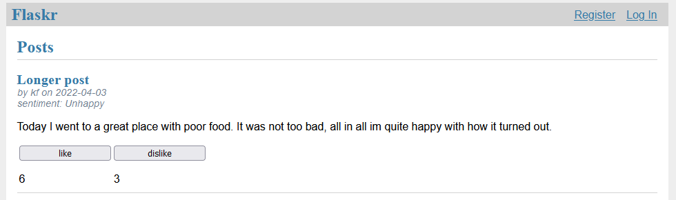

export FLASK_APP=flaskr
export FLASK_ENV=development
flask run

# TODO
* Should make likes not reload entire page but to just update values on the index page.
* Add a response to the blog post
** This should first just be the first word of the post
** Later it can be processing of this text - NLP

# Bugs

# Docs
https://docs.github.com/en/actions/quickstart
https://resources.github.com/whitepapers/GitHub-Actions-Cheat-sheet/
https://www.nobledesktop.com/learn/git/git-branches
https://docs.github.com/en/get-started/using-git/about-git
https://docs.docker.com/language/nodejs/develop/

